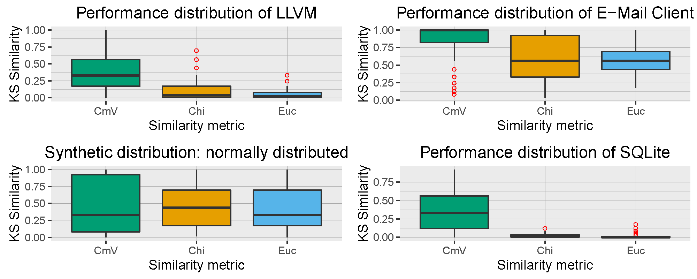

# Raw data of the Goodness-of-Fit evaluation

We executed the genetic algorithm using the Cramer--von Mises Test, Euclidean Test, and Chi-squared Test.
Each execution has been repeated 10 times to account for random factors. We use the following test setup:

Single Peak		
	Features	80
	Feature Distribution	performance/email
		
	Interactions	40
	Interaction Distribution	performance/email
	Order	100/0/0
		
	Variants	26215
	Variant Distribution	performance/email
		
	Sampling	Pseudo Random
	Sample Size	500
		
	Evolutions	15000
		
Multi Peak		
	Features	80
	Feature Distribution	performance/LLVM
		
	Interactions	40
	Interaction Distribution	performance/bdbc
	Order	100/0/0
		
	Variants	26215
	Variant Distribution	performance/LLVM
		
	Sampling	Pseudo Random
	Sample Size	500
		
	Evolutions	15000
		
Nadel		
	Features	80
	Feature Distribution	performance/SQLite
		
	Interactions	40
	Interaction Distribution	binarysize/linux
	Order	100/0/0
		
	Variants	26215
	Variant Distribution	binarysize/SQLite
		
	Sampling	Pseudo Random
	Sample Size	500
		
	Evolutions	15000
		
Normal		
	Features	80
	Feature Distribution	normal dist
		
	Interactions	40
	Interaction Distribution	normal dist
	Order	100/0/0
		
	Variants	26215
	Variant Distribution	normal dist
		
	Sampling	Pseudo Random
	Sample Size	500
		
	Evolutions	15000

## Results

The following plots show the test statistic of the Kolmogorov-Smirnov test of the 4 different experimental setup using the three GoF tests. We show the results for feature distribution and interaction distribution separately.

