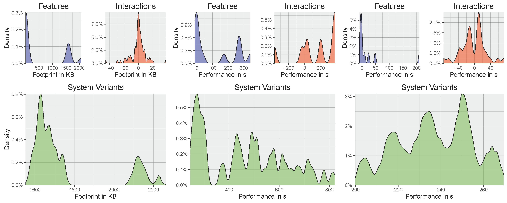

# Corpus Data

## Distribution Profiles

We obtained from others performance, main memory, and binary size measurements of 19 configurable software systems. The data set included the influence of features and (detected) interactions on the respective quality attributes (for more details, see [Author citation], and [Author citation]). In this repository, we present the extracted values as distribution profiles to be used for other variability models. We omit the mapping to the concrete features, interactions, and variants, since they are not relevant when applying the distribution profiles to other variability models.

Berkeley DB					x264				LLVM

The figure shows the distribution profiles (from left to right) of Berkeley DB, x264, and LLVM.

##

In [ValidityComparison](ValidityComparison/), we provide the raw data of the experiments we reported in Section 5.1. The repository includes further graphical comparisons and the whole raw data set.

## Evaluation of Performance Scaling

We provide the raw performance data of the performance scaling experiment, in which we increased the sample set (see Section 5.2).

## Evaluaion of Goodnes-of-Fit (GoF)

In [EvaluaionOfGoF](EvaluaionOfGoF/), we show additional experimental data for comparing the three Goodness-of-Fit tests, including a cross test of all three metrics (not discussed in the paper due to space limitations).

## Example Models
We provide also example models with learned distribution files, ready to use for other researchers in [ExampleModels](ExampleModels/)