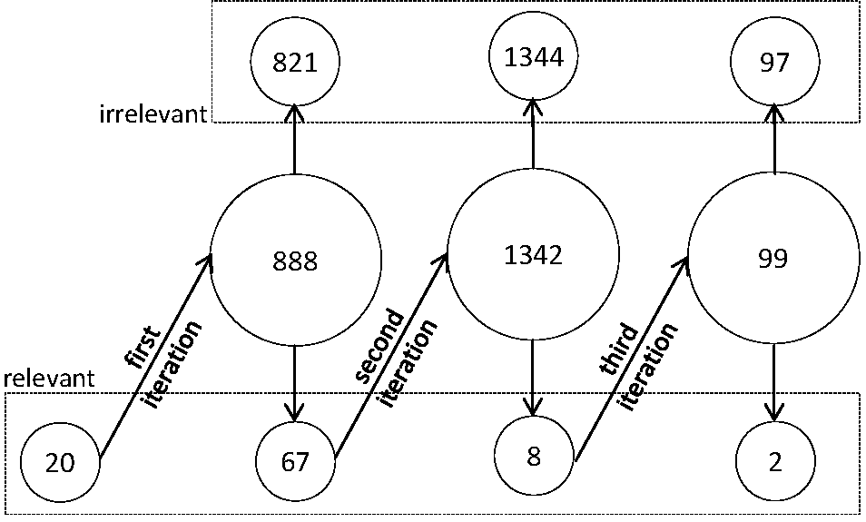
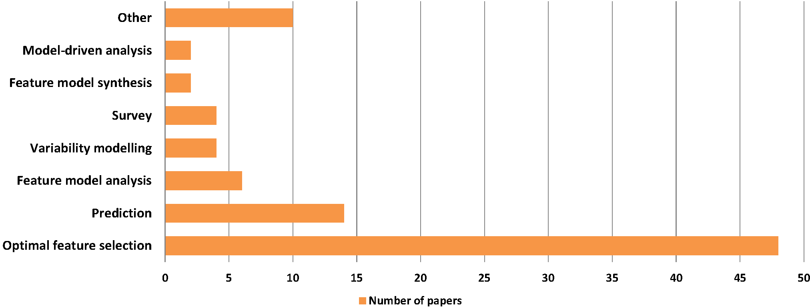

Papers that have been found relevant in our literature study. Note that the number of papers here is a bit higher than the 69 reported in the paper, because we excluded survey papers from our analysis as discussed in Section 2.2. We report the found papers based on our backward and forward iterations.

For the interested reader, we further present the research domains of the analyzed papers.

# Initial Papers:

Antkiewicz, Kacper, Michaland Bk, Alexandr Murashkin, Rafael Olaechea, Jia Hui (jimmy) Liang, and Krzysztof Czarnecki. 2013. “Clafer Tools for Product Line Engineering.” In *Proceedings of the 17th International Software Product Line Conference Co-Located Workshops*, 130–35. SPLC ’13 Workshops. New York, NY, USA: ACM.

Asadi, Mohsen, Samaneh Soltani, Dragan Gasevic, Marek Hatala, and Ebrahim Bagheri. 2014. “Toward Automated Feature Model Configuration with Optimizing Non-Functional Requirements.” *Information and Software Technology* 56 (9): 1144–65.

Bartholdt, J, M Medak, and R Oberhauser. 2009. “Integrating Quality Modeling with Feature Modeling in Software Product Lines.” In *Software Engineering Advances, 2009. ICSEA ’09. Fourth International Conference on*, 365–70.

Benavides, David, Pablo Trinidad, and Antonio Ruiz-Cortés. 2005. “Automated Reasoning on Feature Models.” In *Advanced Information Systems Engineering*, 491–503. Lecture Notes in Computer Science. Springer Berlin Heidelberg.

Etxeberria, Leire, Goiuria Sagardui Mendieta, and Lorea Belategi. 2007. “Modelling Variation in Quality Attributes.” *VaMoS* 7: 51–59.

Ghezzi, C, and A M Sharifloo. 2011. “Verifying Non-Functional Properties of Software Product Lines: Towards an Efficient Approach Using Parametric Model Checking.” In *Software Product Line Conference (SPLC), 2011 15th International*, 170–74.

Guo, Jianmei, Jules White, Guangxin Wang, Jian Li, and Yinglin Wang. 2011. “A Genetic Algorithm for Optimized Feature Selection with Resource Constraints in Software Product Lines.” *J. Syst. Softw.* 84 (12): 2208–21.

Henard, Christopher, Mike Papadakis, Mark Harman, and Yves Le Traon. 2015. “Combining Multi-Objective Search and Constraint Solving for Configuring Large Software Product Lines.” In *Proceedings of the 37th IEEE/ACM International Conference on Software Engineering (ICSE 2015)*.

Murashkin, Alexandr, Derek Antkiewicz Michaland Rayside, and Krzysztof Czarnecki. 2013. “Visualization and Exploration of Optimal Variants in Product Line Engineering.” In *Proceedings of the 17th International Software Product Line Conference*, 111–15. SPLC ’13. New York, NY, USA: ACM.

Olaechea, Rafael, Steven Stewart, Krzysztof Czarnecki, and Derek Rayside. 2012. “Modelling and Multi-Objective Optimization of Quality Attributes in Variability-Rich Software.” In *Proceedings of the Fourth International Workshop on Nonfunctional System Properties in Domain Specific Modeling Languages*, 2:1–2:6. NFPinDSML ’12. New York, NY, USA: ACM.

Raatikainen, Mikko, Eila Niemelä, Varvana Myllärniemi, and Tomi Männistö. 2008. “Svamp-An Integrated Approach for Modeling Functional and Quality Variability.” In *VaMoS*, 89–96.

Roos-Frantz, Fabricia, David Benavides, Antonio Ruiz-Cortés, André Heuer, and Kim Lauenroth. 2011. “Quality-Aware Analysis in Product Line Engineering with the Orthogonal Variability Model.” *Software Qual J* 20 (3-4). Springer US: 519–65.

Sayyad, A S, J Ingram, T Menzies, and H Ammar. 2013. “Scalable Product Line Configuration: A Straw to Break the Camel’s Back.” In *Automated Software Engineering (ASE), 2013 IEEE/ACM 28th International Conference on*, 465–74.

Siegmund, N, M Rosenmuller, C Kastner, P G Giarrusso, S Apel, and S S Kolesnikov. 2011. “Scalable Prediction of Non-Functional Properties in Software Product Lines.” In *Software Product Line Conference (SPLC), 2011 15th International*, 160–69.

Siegmund, Norbert, Sergiy S Kolesnikov, Christian Kästner, Sven Apel, Don Batory, Marko Rosenmüller, and Gunter Saake. 2012. “Predicting Performance via Automated Feature-Interaction Detection.” In *Proceedings of the 34th International Conference on Software Engineering*, 167–77. ICSE ’12. Piscataway, NJ, USA: IEEE Press.

Siegmund, Norbert, Marko Rosenmüller, Christian Kästner, Paolo G Giarrusso, Sven Apel, and Sergiy S Kolesnikov. 2013. “Scalable Prediction of Non-Functional Properties in Software Product Lines: Footprint and Memory Consumption.” *Information and Software Technology* 55 (3): 491–507.

Siegmund, Norbert, Marko Rosenmüller, Martin Kuhlemann, Christian Kästner, Sven Apel, and Gunter Saake. 2011. “SPL Conqueror: Toward Optimization of Non-Functional Properties in Software Product Lines.” *Software Qual J* 20 (3-4). Springer US: 487–517.

Streitferdt, D, Matthias Riebisch, and I Philippow. 2003. “Details of Formalized Relations in Feature Models Using OCL.” In *Engineering of Computer-Based Systems, 2003. Proceedings. 10th IEEE International Conference and Workshop on the*, 297–304.

White, J, D C Schmidt, E Wuchner, and A Nechypurenko. 2007. “Automating Product-Line Variant Selection for Mobile Devices.” In *Software Product Line Conference, 2007. SPLC 2007. 11th International*, 129–40.

White, Jules, Brian Dougherty, and Douglas C Schmidt. 2009. “Selecting Highly Optimal Architectural Feature Sets with Filtered Cartesian Flattening.” *J. Syst. Softw.* 82 (8): 1268–84.

# First Round:

Ali, N, Wei Wu, G Antoniol, M Di Penta, Y Gue´he´neuc, and J H Hayes. 2011. “MoMS: Multi-Objective Miniaturization of Software.” In *Software Maintenance (ICSM), 2011 27th IEEE International Conference on*, 153–62. ieeexplore.ieee.org.

Bagheri, E, and F Ensan. 2014. “Reliability Estimation for Component-Based Software Product Lines.” *Can. J. Electr. Comput. Eng.* 37 (2). ieeexplore.ieee.org: 94–112.

Bagheri, Ebrahim, and Faezeh Ensan. 2013. “Dynamic Decision Models for Staged Software Product Line Configuration.” *Requirements Eng* 19 (2). Springer London: 187–212.

Bagheri, Ebrahim, Mohsen Asadi, Dragan Gasevic, and Samaneh Soltani. 2010. “Stratified Analytic Hierarchy Process: Prioritization and Selection of Software Features.” In *Software Product Lines: Going Beyond*, 300–315. Lecture Notes in Computer Science. Springer Berlin Heidelberg.

Bartholdt, Joerg, Roy Oberhauser, Andreas Rytina, and Marcel Medak. 2010. “Integrating Quality Modeling in Software Product Lines.” *International Journal on Advances in Software* 3 (1 and 2). thinkmind.org: 161–74.

Beek, Maurice H Ter, and Erik P de Vink. 2014. “Using mCRL2 for the Analysis of Software Product Lines.” In *Proceedings of the 2Nd FME Workshop on Formal Methods in Software Engineering*, 31–37. FormaliSE 2014. New York, NY, USA: ACM.

Beek, Maurice H ter, and Erik P de Vink. 2014. “Towards Modular Verification of Software Product Lines with mCRL2.” In *Leveraging Applications of Formal Methods, Verification and Validation. Technologies for Mastering Change*, 368–85. Lecture Notes in Computer Science. Springer Berlin Heidelberg.

Bécan, Guillaume, Razieh Behjati, Arnaud Gotlieb, and Mathieu Acher. 2015. “Synthesis of Attributed Feature Models from Product Descriptions: Foundations,” 16~feb.

Boskovic, M, D Gasevic, B Mohabbati, and others. 2011. “Developing Families of Software Services: A Semantic Web Approach.” *Journal of Research*. search.informit.com.au.

Bürdek, Johannes, Sascha Lity, Malte Lochau, Markus Berens, Ursula Goltz, and Andy Schürr. 2013. “Staged Configuration of Dynamic Software Product Lines with Complex Binding Time Constraints.” In *Proceedings of the Eighth International Workshop on Variability Modelling of Software-Intensive Systems*, 16:1–16:8. VaMoS ’14. New York, NY, USA: ACM.

Configurator, Interactive Product. n.d. “FdConfig: A Constraint-Based Interactive Product Configurator.” *Applications of Declarative Programming and Knowledge Management*. Springer, 239.

Dubslaff, Clemens, Sascha Klüppelholz, and Christel Baier. 2014. “Probabilistic Model Checking for Energy Analysis in Software Product Lines.” In *Modularity*, 169–80. ACM.

Galindo, José A, Hamilton Turner, David Benavides, and Jules White. 2014. “Testing Variability-Intensive Systems Using Automated Analysis: An Application to Android.” *Software Qual J*, 12~nov. Springer US, 1–41.

García Pascual, Gustavo, Mónica Pinto, and Lidia Fuentes Fernández. 2013. “Run-Time Adaptation of Mobile Applications Using Genetic Algorithms.” IEEE Press.

García-Galán, Jesús, Liliana Pasquale, Pablo Trinidad, and Antonio Ruiz-Cortés. 2014. “User-Centric Adaptation of Multi-Tenant Services: Preference-Based Analysis for Service Reconfiguration.” In *Proceedings of the 9th International Symposium on Software Engineering for Adaptive and Self-Managing Systems*, 65–74. SEAMS 2014. New York, NY, USA: ACM.

Grebhahn, Alexander, Sebastian Kuckuk, Christian Schmitt, Harald Köstler, Norbert Siegmund, Sven Apel, Frank Hannig, and Jürgen Teich. 2014. “Experiments on Optimizing the Performance of Stencil Codes with SPL Conqueror.” *Parallel Process. Lett.* 24 (03). World Scientific: 1441001.

Guana, Victor, and Dario Correal. 2011. “Variability Quality Evaluation on Component-Based Software Product Lines.” In *Proceedings of the 15th International Software Product Line Conference, Volume 2*, 19:1–19:8. SPLC ’11. New York, NY, USA: ACM.

———. 2013. “Improving Software Product Line Configuration: A Quality Attribute-Driven Approach.” *Information and Software Technology* 55 (3). Elsevier: 541–62.

Guo, J, K Czarnecki, S Apel, N Siegmund, and A Wasowski. n.d. “Why CART Works for Variability-Aware Performance Prediction? An Empirical Study on Performance Distributions.”

Guo, Jianmei, K Czarnecki, S Apel, N Siegmund, and A Wasowski. 2013. “Variability-Aware Performance Prediction: A Statistical Learning Approach.” In *Automated Software Engineering (ASE), 2013 IEEE/ACM 28th International Conference on*, 301–11.

Guo, Jianmei, Edward Zulkoski, Rafael Olaechea, Derek Rayside, Krzysztof Czarnecki, Sven Apel, and Joanne M Atlee. 2014. “Scaling Exact Multi-Objective Combinatorial Optimization by Parallelization.” In *Proceedings of the 29th ACM/IEEE International Conference on Automated Software Engineering*, 409–20. ASE ’14. New York, NY, USA: ACM.

Harman, Mark, S Afshin Mansouri, and Yuanyuan Zhang. 2009. “Search Based Software Engineering: A Comprehensive Analysis and Review of Trends Techniques and Applications.” *Department of Computer Science, King’s College London, Tech. Rep. TR-09-03*.

Heijblom, R. 2013. “Potential of Integer Programming for Optimization Analysis of Extended Feature Models.” fmt.cs.utwente.nl.

Henard, Christopher, Mike Papadakis, Gilles Perrouin, Jacques Klein, and Yves Le Traon. 2013. “Multi-Objective Test Generation for Software Product Lines.” In *Proceedings of the 17th International Software Product Line Conference*, 62–71. SPLC ’13. New York, NY, USA: ACM.

Karatas, Ahmet Serkan, and Halit Oguztüzün. 2014. “Attribute-Based Variability in Feature Models.” *Requirements Eng*, 6~nov. Springer London, 1–24.

Karatas, Ahmet Serkan, Halit Oguztüzün, and Ali Dogru. 2010. “Global Constraints on Feature Models.” In *Principles and Practice of Constraint Programming – CP 2010*, 537–51. Lecture Notes in Computer Science. Springer Berlin Heidelberg.

———. 2013. “From Extended Feature Models to Constraint Logic Programming.” *Science of Computer Programming* 78 (12). Elsevier: 2295–2312.

Krogmann, K, M Kuperberg, and R Reussner. 2010. “Using Genetic Search for Reverse Engineering of Parametric Behavior Models for Performance Prediction.” *IEEE Trans. Software Eng.* 36 (6): 865–77.

Lesta, Uwe, Ina Schaefer, and Tim Winkelmann. 2015. “Detecting and Explaining Conflicts in Attributed Feature Models,” 14~apr.

Lian, Xiaoli, and Li Zhang. 2015. “Optimized Feature Selection Towards Functional and Non-Functional Requirements in Software Product Lines.” In *Software Analysis, Evolution and Reengineering (SANER), 2015 IEEE 22nd International Conference on*, 191–200. ieeexplore.ieee.org.

Liang, Jimmy. 2012. “Solving Clafer Models with Choco.” GSDLab-TR.

Lillack, M, J Müller, and U W Eisenecker. 2013. “Improved Prediction of Non-Functional Properties in Software Product Lines with Domain Context.” *Software Engineering*. Citeseer.

LiZhang, Xiaoli Lian. 2013. “An Evolutionary Methodology for Optimized Feature Selection in Software Product Lines.” In *International Conference on Software Engineering & Knowledge Engineering (SEKE)*. Knowledge Systems Institute Graduate School.

Machado, Lucas, Juliana Pereira, Lucas Garcia, and Eduardo Figueiredo. 2014. “SPLConfig: Product Configuration in Software Product Line.” In *Brazilian Congress on Software (CBSoft), Tools Session*, 1–8. homepages.dcc.ufmg.br.

Ognjanovic, I, B Mohabbati, D Gaevic, E Bagheri, and M Bokovic. 2012. “A Metaheuristic Approach for the Configuration of Business Process Families.” In *Services Computing (SCC), 2012 IEEE Ninth International Conference on*, 25–32. ieeexplore.ieee.org.

Olaechea, Rafael, Derek Rayside, Jianmei Guo, and Krzysztof Czarnecki. 2014. “Comparison of Exact and Approximate Multi-Objective Optimization for Software Product Lines.” In *Proceedings of the 18th International Software Product Line Conference - Volume 1*, 92–101. SPLC ’14. New York, NY, USA: ACM.

Pascual, Gustavo G, Roberto E Lopez-Herrejon, Mónica Pinto, Lidia Fuentes, and Alexander Egyed. 2015. “Applying Multiobjective Evolutionary Algorithms to Dynamic Software Product Lines for Reconfiguring Mobile Applications.” *J. Syst. Softw.* 103 (0). Elsevier: 392–411.

Pascual, Gustavo G, Mónica Pinto, and Lidia Fuentes. 2014. “Self-Adaptation of Mobile Systems Driven by the Common Variability.” researchgate.net.

Quinton, C, D Romero, and L Duchien. 2014. “Automated Selection and Configuration of Cloud Environments Using Software Product Lines Principles.” In *Cloud Computing (CLOUD), 2014 IEEE 7th International Conference on*, 144–51. ieeexplore.ieee.org.

Quinton, Clément, Romain Rouvoy, and Laurence Duchien. 2012. “Leveraging Feature Models to Configure Virtual Appliances.” In *Proceedings of the 2Nd International Workshop on Cloud Computing Platforms*, 2:1–2:6. CloudCP ’12. New York, NY, USA: ACM.

Rocha Soares, L, P Potena, I Do Carmo Machado, I Crnkovic, and E Santana de Almeida. 2014. “Analysis of Non-Functional Properties in Software Product Lines: A Systematic Review.” In *Software Engineering and Advanced Applications (SEAA), 2014 40th EUROMICRO Conference on*, 328–35. ieeexplore.ieee.org.

Sanchez, L E, J A Diaz-Pace, A Zunino, S Moisan, and J-P Rigault. 2014. “An Approach for Managing Quality Attributes at Runtime Using Feature Models.” In *Software Components, Architectures and Reuse (SBCARS), 2014 Eighth Brazilian Symposium on*, 11–20. ieeexplore.ieee.org.

Sanchez, L E, S Moisan, and J-P Rigault. 2013. “Metrics on Feature Models to Optimize Configuration Adaptation at Run Time.” In *Combining Modelling and Search-Based Software Engineering (CMSBSE), 2013 1st International Workshop on*, 39–44. ieeexplore.ieee.org.

Sayyad, A S, and H Ammar. 2013. “Pareto-Optimal Search-Based Software Engineering: A Literature Survey.” *Proc. RAISE*.

Sayyad, A S, K Goseva-Popstojanova, T Menzies, and H Ammar. 2013. “On Parameter Tuning in Search Based Software Engineering: A Replicated Empirical Study.” In *Replication in Empirical Software Engineering Research (RESER), 2013 3rd International Workshop on*, 84–90.

Sayyad, A S, J Ingram, T Menzies, and H Ammar. 2013. “Optimum Feature Selection in Software Product Lines: Let Your Model and Values Guide Your Search.” In *Combining Modelling and Search-Based Software Engineering (CMSBSE), 2013 1st International Workshop on*, 22–27. ieeexplore.ieee.org.

Sayyad, A S, T Menzies, and H Ammar. 2013. “On the Value of User Preferences in Search-Based Software Engineering: A Case Study in Software Product Lines.” In *Software Engineering (ICSE), 2013 35th International Conference on*, 492–501.

Shi, Runyu, Jianmei Guo, and Yinglin Wang. 2010. “A Preliminary Experimental Study on Optimal Feature Selection for Product Derivation Using Knapsack Approximation.” In *Progress in Informatics and Computing (PIC), 2010 IEEE International Conference on*, 1:665–69. ieeexplore.ieee.org.

Siegmund, Norbert, Sergiy S Kolesnikov, Christian Kästner, Sven Apel, Don S Batory, Marko Rosenmüller, and Gunter Saake. 2014. “Performance Prediction in the Presence of Feature Interactions.” In *Software Engineering*, 33–34. researchgate.net.

Siegmund, Norbert, Alexander von Rhein, and Sven Apel. 2013. “Family-Based Performance Measurement.” In *Proceedings of the 12th International Conference on Generative Programming: Concepts & Experiences*, 95–104. GPCE ’13. New York, NY, USA: ACM.

Sincero, Julio, Olaf Spinczyk, and Wolfgang Schröder-Preikschat. 2007. “On the Configuration of Non-Functional Properties in Software Product Lines.” In *SPLC (2)*, 167–73.

Soltani, Samaneh, Mohsen Asadi, Dragan Gaševic, Marek Hatala, and Ebrahim Bagheri. 2012. “Automated Planning for Feature Model Configuration Based on Functional and Non-Functional Requirements.” In *Proceedings of the 16th International Software Product Line Conference - Volume 1*, 56–65. SPLC ’12. New York, NY, USA: ACM.

Soltani, Samaneh, Mohsen Asadi, Marek Hatala, Dragan Gasevic, and Ebrahim Bagheri. 2011. “Automated Planning for Feature Model Configuration Based on Stakeholders’ Business Concerns.” In *Proceedings of the 2011 26th IEEE/ACM International Conference on Automated Software Engineering*, 536–39. ASE ’11. Washington, DC, USA: IEEE Computer Society.

Stein, Jacob, Ingrid Nunes, and Elder Cirilo. 2014. “Preference-Based Feature Model Configuration with Multiple Stakeholders.” In *Proceedings of the 18th International Software Product Line Conference - Volume 1*, 132–41. SPLC ’14. New York, NY, USA: ACM.

Tawhid, Rasha, and Dorina Petriu. 2008. “Integrating Performance Analysis in the Model Driven Development of Software Product Lines.” In *Model Driven Engineering Languages and Systems*, 490–504. Lecture Notes in Computer Science. Springer Berlin Heidelberg.

Trendowicz, Adam, Teade Punter, and Others. 2003. “Quality Modeling for Software Product Lines.” In *7th ECOOP Workshop on Quantitative Approaches in Object-Oriented Software Engineering (QAOOSE’03)*. Citeseer.

White, J, B Doughtery, and D C Schmidt. 2008. “Filtered Cartesian Flattening: An Approximation Technique for Optimally Selecting Features While Adhering to Resource Constraints.” *SPLC (2)*. cs.wustl.edu.

White, Jules, Douglas C Schmidt, Egon Wuchner, and Andrey Nechypurenko. 2008. “Automatically Composing Reusable Software Components for Mobile Devices.” *J. Braz. Comput. Soc.* 14 (1). Sociedade Brasileira de Computação: 25–44.

Wittern, Erik, and Christian Zirpins. 2014. “Service Feature Modeling: Modeling and Participatory Ranking of Service Design Alternatives.” *Softw Syst Model*, 23~may. Springer Berlin Heidelberg, 1–26.

Wu, Zhiqiao, Jiafu Tang, C K Kwong, and C Y Chan. 2011. “AN OPTIMIZATION MODEL FOR REUSE SCENARIO SELECTION CONSIDERING RELIABILITY AND COST IN SOFTWARE PRODUCT LINE DEVELOPMENT.” *Int. J. Inf. Technol. Decis. Mak.* 10 (05): 811–41.

Zhang, Guoheng, Huilin Ye, and Yuqing Lin. 2011. “Using Knowledge-Based Systems to Manage Quality Attributes in Software Product Lines.” In *Proceedings of the 15th International Software Product Line Conference, Volume 2*, 32:1–32:7. SPLC ’11. New York, NY, USA: ACM.

———. 2013. “Quality Attribute Modeling and Quality Aware Product Configuration in Software Product Lines.” *Software Qual J* 22 (3). Springer US: 365–401.

Zhang, Hongyu, Stan Jarzabek, and Bo Yang. 2003. “Quality Prediction and Assessment for Product Lines.” In *Advanced Information Systems Engineering*, 681–95. Lecture Notes in Computer Science. Springer Berlin Heidelberg.

Zulkoski, Ed, Chris Kleynhans, Ming-Ho Yee, Derek Rayside, and Krzysztof Czarnecki. 2014. “Optimizing Alloy for Multi-Objective Software Product Line Configuration.” In *Abstract State Machines, Alloy, B, TLA, VDM, and Z*, 328–33. Lecture Notes in Computer Science. Springer Berlin Heidelberg.

Zuluaga, Marcela, Guillaume Sergent, Andreas Krause, and Markus Püschel. 2013. “Active Learning for Multi-Objective Optimization.” In *Proceedings of the 30th International Conference on Machine Learning*, 462–70. jmlr.org.

# Second Round:

Beek, Maurice H ter, Axel Legay, Alberto Lluch Lafuente, and Andrea Vandin. 2015. “Quantitative Analysis of Probabilistic Models of Software Product Lines with Statistical Model Checking,” 14~apr.

García-Galán, Jesús, Pablo Trinidad, Omer F Rana, and Antonio Ruiz-Cortés. n.d. “Automated Configuration Support for Infrastructure Migration to the Cloud.” *Future Gener. Comput. Syst.*

Olaechea, Rafael, Steven Stewart, Krzysztof Czarnecki, and Derek Rayside. 2012. “Modelling and Optimization of Quality Attributes in Variability-Rich Software.” In *NFPinDSML Workshop at MODELS Conference*.

Pasquale, Liliana, Pablo Trinidad, and Antonio Ruiz-Cortés. 2014. “User-Centric Adaptation Analysis of Multi-Tenant Services.” In *International Symposium on Software Engineering for Adaptive and Self-Managing Systems*, 65–74.

Sanchez, L Emiliano, J Andres Diaz-Pace, Alejandro Zunino, Sabine Moisan, and Jean-Paul Rigault. 2015. “An Approach Based on Feature Models and Quality Criteria for Adapting Component-Based Systems.” *Journal of Software Engineering Research and Development* 3 (1). Springer: 1–30.

Song, Hui, Stephen Barrett, Aidan Clarke, and Siobhán Clarke. 2013. “Self-Adaptation with End-User Preferences: Using Run-Time Models and Constraint Solving.” In *Model-Driven Engineering Languages and Systems*, 555–71. Lecture Notes in Computer Science. Springer Berlin Heidelberg.

Tan, Tian Huat, Yinxing Xue, Manman Chen, Jun Sun, Yang Liu, and Jin Song Dong. 2015. “Optimizing Selection of Competing Features via Feedback-Directed Evolutionary Algorithms.” In *Proceedings of the 2015 International Symposium on Software Testing and Analysis*, 246–56. ISSTA 2015. New York, NY, USA: ACM.

Wittern, E, A Lenk, S Bartenbach, and T Braeuer. 2014. “Feature-Based Configuration of Vendor-Independent Deployments on IaaS.” In *Enterprise Distributed Object Computing Conference (EDOC), 2014 IEEE 18th International*, 128–35.

# Third Round:

Beek, M H ter, A Legay, A Lluch Lafuente, and A Vandin. 2015. “Statistical Analysis of Probabilistic Models of Software Product Lines with Quantitative Constraints.” In *Proceedings of the 19th International Conference on Software Product Line*, 11–15. SPLC ’15. New York, NY, USA: ACM.

Garcia-Galán, J, L Pasquale, P Trinidad, and A R Cortés. 2014. “User-Centric Adaptation Analysis of Multi-Tenant Services.” *Transactions on Autonomous and Adaptive Systems*, 158.

