Statistical companion
================
n/a
2017-02-23

-   Prerequisites
    -   How to (re-)generate the companion report
    -   R packages
-   Data description
    -   ALGO=IBEA
    -   ALGO=NSGAII
-   Analysis of variances (for ALGO = IBEA)
    -   Checks
    -   Anova table: Hypervolume (HV)
    -   Anova table: PCORRECT
    -   Significant differences: Tukey HSD
-   Detach R packages

Prerequisites
=============

How to (re-)generate the companion report
-----------------------------------------

(This assumes that the R package `rmarkdown` is installed, in doubt, run from within R: `install.packages("rmarkdown")`.)

1.  Clone the repo or download its content
2.  `cd replication/data`
3.  `Rscript -e "rmarkdown::render('companion.Rmd','all', params = list(spl = 'Paxtls1of3'))"`
4.  Open `companion.html`

R packages
----------

``` {.r}
wants <- c("ggplot2", "reshape2", "car", "pander")
has   <- wants %in% rownames(installed.packages())
if(any(!has)) install.packages(wants[!has], repos = "http://cran.us.r-project.org")
```

``` {.r}
library(reshape2)
library(ggplot2)
```

    ## Warning: package 'ggplot2' was built under R version 3.3.2

``` {.r}
library(car)
library(pander)

all <- read.csv2(params$data)
df <- subset(all, SPL == params$spl)
levels(df$DIST) <- c("normal", "uniform", "x264")
```

Data description
================

### ALGO=IBEA

``` {.r}
DATA <- subset(df, ALGO == "IBEA" & FINT %in% c("F","FI20","FI100"))
```

``` {.r}
acast(DATA, DIST ~ FINT, length)
```

    ##           F FI100 FI20
    ## normal  200   200  200
    ## uniform 200   200  200
    ## x264    200   200  200

``` {.r}
ggplot(na.omit(subset(DATA, VARIABLE=="HV")), aes(y=value, x = 1)) +
    geom_violin() + geom_boxplot(width = 0.2) +
        facet_wrap(DIST ~ FINT, ncol = 3, drop = TRUE) +
            stat_summary(fun.y="median", geom="point") +
                stat_summary(fun.y="mean", geom="point", shape=3) + xlab("HV")
```

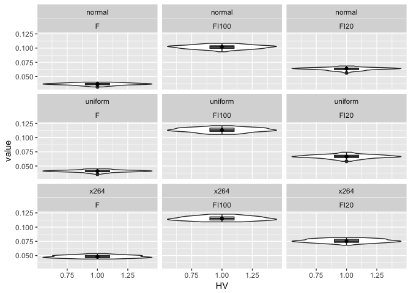

``` {.r}
ggplot(na.omit(subset(DATA, VARIABLE=="PCORRECT")), aes(y=value, x = 1)) +
    geom_violin() + geom_boxplot(width = 0.2) +
        facet_wrap(DIST ~ FINT, ncol = 3, drop = TRUE) +
            stat_summary(fun.y="median", geom="point") +
                stat_summary(fun.y="mean", geom="point", shape=3) + xlab("PCORRECT")
```

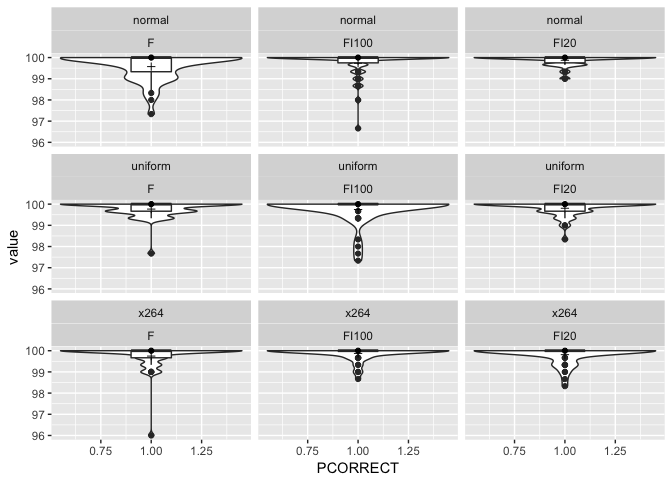

``` {.r}
tta <- na.omit(subset(DATA, VARIABLE=="TimeToAnyC"))

if (nrow(tta)) {
    ggplot(tta, aes(y=value, x = 1)) +
        geom_violin() + geom_boxplot(width = 0.2) +
        facet_wrap(DIST ~ FINT, ncol = 3, drop = TRUE) +
        stat_summary(fun.y="median", geom="point") +
        stat_summary(fun.y="mean", geom="point", shape=3) +
        xlab("TimeToAnyC")
}
```

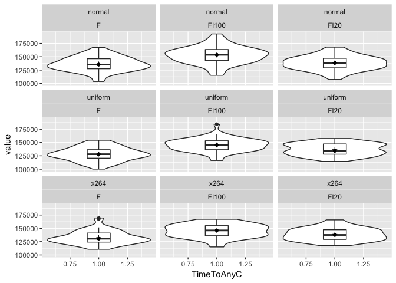

### ALGO=NSGAII

``` {.r}
DATA <- subset(df, ALGO == "NSGAII" & FINT %in% c("F","FI20","FI100"))
```

``` {.r}
acast(DATA, DIST ~ FINT, length)
```

    ##           F FI100 FI20
    ## normal  200   200  200
    ## uniform 200   200  200
    ## x264    200   200  200

``` {.r}
ggplot(na.omit(subset(DATA, VARIABLE=="HV")), aes(y=value, x = 1)) +
    geom_violin() + geom_boxplot(width = 0.2) +
        facet_wrap(DIST ~ FINT, ncol = 3, drop = TRUE) +
            stat_summary(fun.y="median", geom="point") +
                stat_summary(fun.y="mean", geom="point", shape=3) + xlab("HV")
```

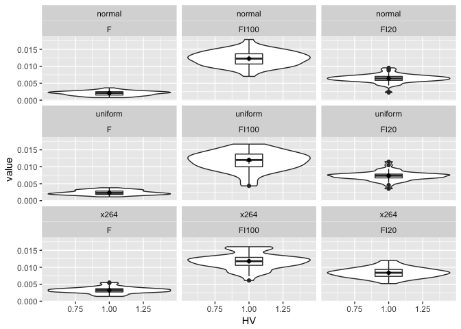

``` {.r}
## & value < 1000

ggplot(na.omit(subset(DATA, VARIABLE=="PCORRECT")), aes(y=value, x = 1)) +
    geom_violin() + geom_boxplot(width = 0.2) +
        facet_wrap(DIST ~ FINT, ncol = 3, drop = TRUE) +
            stat_summary(fun.y="median", geom="point") +
                stat_summary(fun.y="mean", geom="point", shape=3) + xlab("PCORRECT")
```

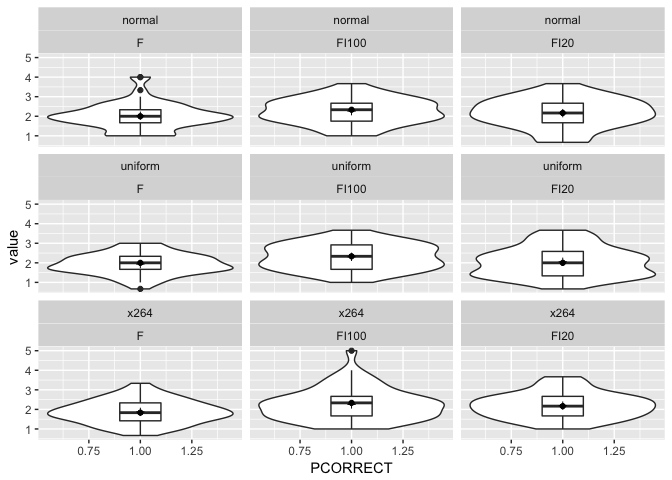

``` {.r}
## & value < 50000

tta <- na.omit(subset(DATA, VARIABLE=="TimeToAnyC"))

if (nrow(tta)) {
    ggplot(tta, aes(y=value, x = 1)) +
        geom_violin() + geom_boxplot(width = 0.2) +
        facet_wrap(DIST ~ FINT, ncol = 3, drop = TRUE) +
        stat_summary(fun.y="median", geom="point") +
        stat_summary(fun.y="mean", geom="point", shape=3) + xlab("TimeToAnyC")
}
```

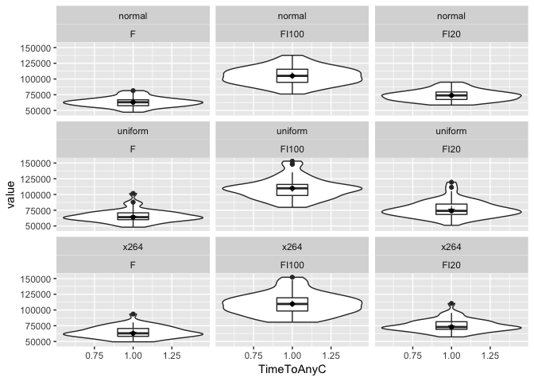

Analysis of variances (for ALGO = IBEA)
=======================================

``` {.r}
DATA <- subset(df, ALGO == "IBEA" & FINT %in% c("F","FI100") & DIST %in% c("normal","x264"))
d.hv.glm <- glm(value ~ FINT * DIST, family = gaussian, data = subset(DATA, VARIABLE == "HV"))
d.pc.glm <- glm(value ~ FINT * DIST, family = gaussian, data = subset(DATA, VARIABLE == "PCORRECT"))
```

### Checks

#### Normality of residuals

``` {.r}
hv.res <- residuals(d.hv.glm)
QQplot(hv.res)
```


``` {.r}
pc.res <- residuals(d.pc.glm)
QQplot(pc.res)
```

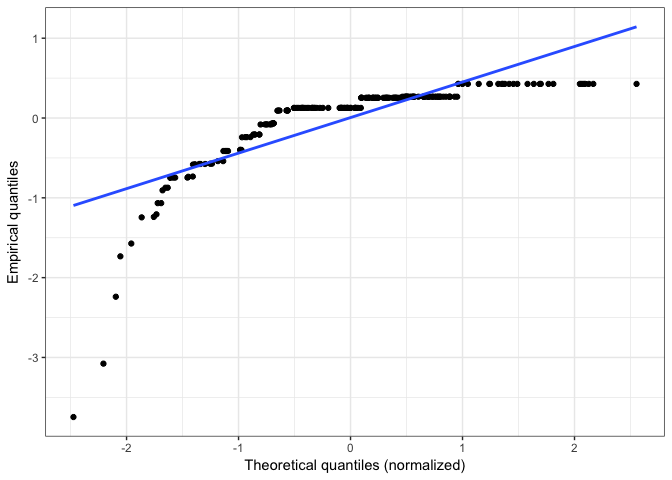

#### Homogeneity of variances

``` {.r}
hv <- subset(DATA, VARIABLE == "HV")
hv$combn <- interaction(hv$FINT,hv$DIST)
pc <- subset(DATA, VARIABLE == "PCORRECT")
pc$combn <- interaction(pc$FINT,pc$DIST)

ggplot(data=hv, aes(y = value, x = 1)) + geom_boxplot() + facet_wrap(~ combn, nrow=1) + theme_bw()
```

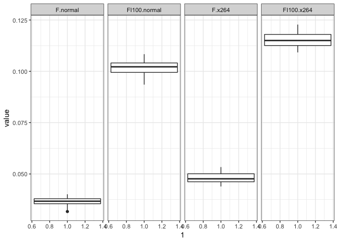

``` {.r}
ggplot(data=pc, aes(y = value, x = 1)) + geom_boxplot() + facet_wrap(~ combn, nrow=1) + theme_bw()
```

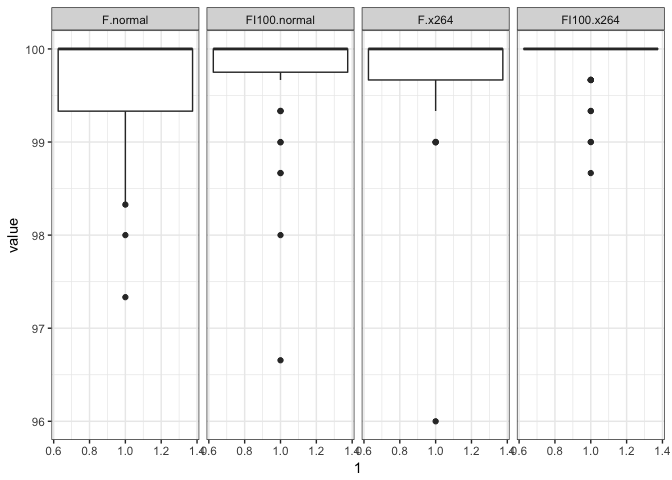

``` {.r}
l.test <- cbind(as.numeric(leveneTest(value ~ FINT * DIST, data = hv)[1,]),
      as.numeric(leveneTest(value ~ FINT * DIST, data = hv, center = mean)[1,]),
                as.numeric(leveneTest(value ~ FINT * DIST, data = pc)[1,]),
      as.numeric(leveneTest(value ~ FINT * DIST, data = pc, center = mean)[1,]))

colnames(l.test) <- c("median","mean","median","mean")
rownames(l.test) <- c("Df", "F", "p-value")
pander(l.test)
```

<table>
<colgroup>
<col width="19%" />
<col width="13%" />
<col width="13%" />
<col width="12%" />
<col width="12%" />
</colgroup>
<thead>
<tr class="header">
<th align="center"> </th>
<th align="center">median</th>
<th align="center">mean</th>
<th align="center">median</th>
<th align="center">mean</th>
</tr>
</thead>
<tbody>
<tr class="odd">
<td align="center"><strong>Df</strong></td>
<td align="center">3</td>
<td align="center">3</td>
<td align="center">3</td>
<td align="center">3</td>
</tr>
<tr class="even">
<td align="center"><strong>F</strong></td>
<td align="center">8.044</td>
<td align="center">8.355</td>
<td align="center">2.419</td>
<td align="center">4.129</td>
</tr>
<tr class="odd">
<td align="center"><strong>p-value</strong></td>
<td align="center">4.411e-05</td>
<td align="center">2.959e-05</td>
<td align="center">0.06742</td>
<td align="center">0.007245</td>
</tr>
</tbody>
</table>

### Anova table: Hypervolume (HV)

``` {.r}
ggplot(na.omit(subset(DATA, VARIABLE == "HV")), aes(y=value, x = 1)) +
    geom_violin() + geom_boxplot(width = 0.2) +
        facet_wrap(DIST ~ FINT, ncol = 2, drop = TRUE) +
            stat_summary(fun.y="median", geom="point") +
                stat_summary(fun.y="mean", geom="point", shape=3) + xlab("HV")
```

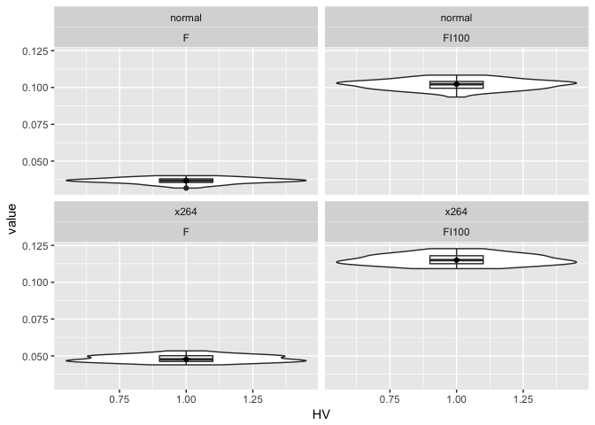

``` {.r}
panderOptions('digits', 4)
## panderOptions('round', 4)
panderOptions('keep.trailing.zeros', TRUE)
pander(anova(d.hv.glm, test = "F"))
```

<table>
<caption>Analysis of Deviance Table</caption>
<colgroup>
<col width="21%" />
<col width="6%" />
<col width="15%" />
<col width="16%" />
<col width="17%" />
<col width="8%" />
<col width="13%" />
</colgroup>
<thead>
<tr class="header">
<th align="center"> </th>
<th align="center">Df</th>
<th align="center">Deviance</th>
<th align="center">Resid. Df</th>
<th align="center">Resid. Dev</th>
<th align="center">F</th>
<th align="center">Pr(&gt;F)</th>
</tr>
</thead>
<tbody>
<tr class="odd">
<td align="center"><strong>NULL</strong></td>
<td align="center">NA</td>
<td align="center">NA</td>
<td align="center">199</td>
<td align="center">0.2286</td>
<td align="center">NA</td>
<td align="center">NA</td>
</tr>
<tr class="even">
<td align="center"><strong>FINT</strong></td>
<td align="center">1</td>
<td align="center">0.2192</td>
<td align="center">198</td>
<td align="center">0.009401</td>
<td align="center">26154</td>
<td align="center">1.452e-210</td>
</tr>
<tr class="odd">
<td align="center"><strong>DIST</strong></td>
<td align="center">1</td>
<td align="center">0.007718</td>
<td align="center">197</td>
<td align="center">0.001683</td>
<td align="center">920.9</td>
<td align="center">5.405e-76</td>
</tr>
<tr class="even">
<td align="center"><strong>FINT:DIST</strong></td>
<td align="center">1</td>
<td align="center">4.025e-05</td>
<td align="center">196</td>
<td align="center">0.001643</td>
<td align="center">4.803</td>
<td align="center">0.02958</td>
</tr>
</tbody>
</table>

``` {.r}
aov.hv <- aov(value ~ FINT * DIST,
              data = droplevels(subset(DATA, VARIABLE == "HV")))
pander(aov.hv)
```

<table>
<caption>Analysis of Variance Model</caption>
<colgroup>
<col width="22%" />
<col width="6%" />
<col width="13%" />
<col width="13%" />
<col width="13%" />
<col width="13%" />
</colgroup>
<thead>
<tr class="header">
<th align="center"> </th>
<th align="center">Df</th>
<th align="center">Sum Sq</th>
<th align="center">Mean Sq</th>
<th align="center">F value</th>
<th align="center">Pr(&gt;F)</th>
</tr>
</thead>
<tbody>
<tr class="odd">
<td align="center"><strong>FINT</strong></td>
<td align="center">1</td>
<td align="center">0.2192</td>
<td align="center">0.2192</td>
<td align="center">26154</td>
<td align="center">1.452e-210</td>
</tr>
<tr class="even">
<td align="center"><strong>DIST</strong></td>
<td align="center">1</td>
<td align="center">0.007718</td>
<td align="center">0.007718</td>
<td align="center">920.9</td>
<td align="center">5.405e-76</td>
</tr>
<tr class="odd">
<td align="center"><strong>FINT:DIST</strong></td>
<td align="center">1</td>
<td align="center">4.025e-05</td>
<td align="center">4.025e-05</td>
<td align="center">4.803</td>
<td align="center">0.02958</td>
</tr>
<tr class="even">
<td align="center"><strong>Residuals</strong></td>
<td align="center">196</td>
<td align="center">0.001643</td>
<td align="center">8.381e-06</td>
<td align="center">NA</td>
<td align="center">NA</td>
</tr>
</tbody>
</table>

``` {.r}
pander(my.etasq(aov.hv))
```

<table>
<colgroup>
<col width="23%" />
<col width="26%" />
<col width="27%" />
</colgroup>
<tbody>
<tr class="odd">
<td align="center">FINT</td>
<td align="center">DIST</td>
<td align="center">FINT:DIST</td>
</tr>
<tr class="even">
<td align="center">0.96581568427347</td>
<td align="center">0.0340069384588839</td>
<td align="center">0.000177377267646053</td>
</tr>
</tbody>
</table>

``` {.r}
my.interactionPlot(subset(DATA, VARIABLE == "HV"))
```

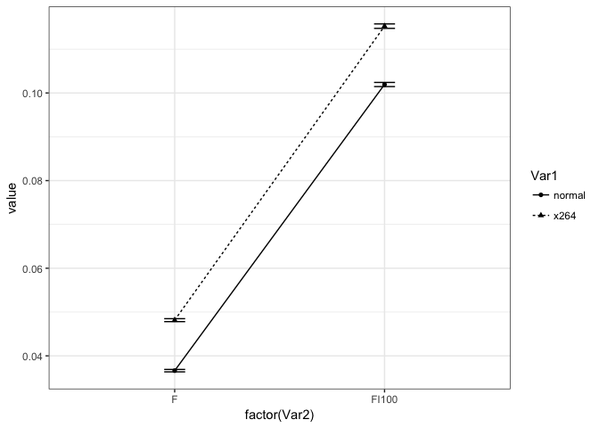

``` {.r}
my.nestedBoxplot(subset(DATA, VARIABLE == "HV"))
```

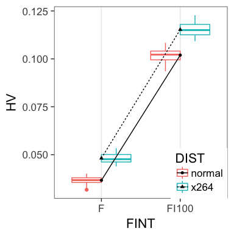

### Anova table: PCORRECT

``` {.r}
d.pc.glm <- glm(value ~ FINT * DIST, family = gaussian, data = subset(DATA, VARIABLE == "PCORRECT"))

ggplot(na.omit(subset(DATA, VARIABLE == "PCORRECT")), aes(y=value, x = 1)) +
    geom_violin() + geom_boxplot(width = 0.2) +
    facet_wrap(DIST ~ FINT, ncol = 2, drop = TRUE) +
    stat_summary(fun.y="median", geom="point") +
    stat_summary(fun.y="mean", geom="point", shape=3) + xlab("PCORRECT")
```

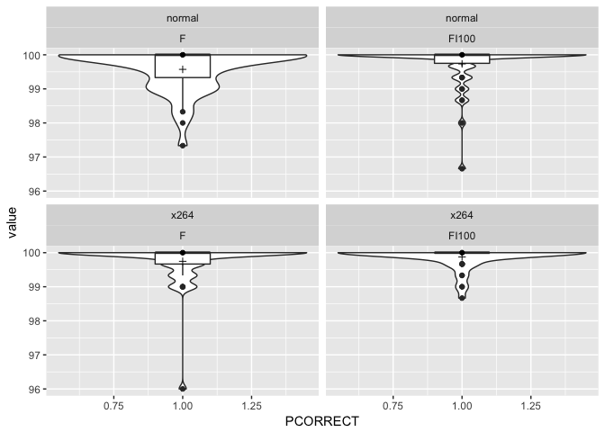

``` {.r}
pander(anova(d.pc.glm, test = "F"))
```

<table>
<caption>Analysis of Deviance Table</caption>
<colgroup>
<col width="21%" />
<col width="6%" />
<col width="15%" />
<col width="16%" />
<col width="17%" />
<col width="10%" />
<col width="10%" />
</colgroup>
<thead>
<tr class="header">
<th align="center"> </th>
<th align="center">Df</th>
<th align="center">Deviance</th>
<th align="center">Resid. Df</th>
<th align="center">Resid. Dev</th>
<th align="center">F</th>
<th align="center">Pr(&gt;F)</th>
</tr>
</thead>
<tbody>
<tr class="odd">
<td align="center"><strong>NULL</strong></td>
<td align="center">NA</td>
<td align="center">NA</td>
<td align="center">199</td>
<td align="center">63.85</td>
<td align="center">NA</td>
<td align="center">NA</td>
</tr>
<tr class="even">
<td align="center"><strong>FINT</strong></td>
<td align="center">1</td>
<td align="center">1.031</td>
<td align="center">198</td>
<td align="center">62.81</td>
<td align="center">3.282</td>
<td align="center">0.07155</td>
</tr>
<tr class="odd">
<td align="center"><strong>DIST</strong></td>
<td align="center">1</td>
<td align="center">1.235</td>
<td align="center">197</td>
<td align="center">61.58</td>
<td align="center">3.93</td>
<td align="center">0.04882</td>
</tr>
<tr class="even">
<td align="center"><strong>FINT:DIST</strong></td>
<td align="center">1</td>
<td align="center">0.01419</td>
<td align="center">196</td>
<td align="center">61.57</td>
<td align="center">0.04517</td>
<td align="center">0.8319</td>
</tr>
</tbody>
</table>

``` {.r}
aov.pc <- aov(value ~ FINT * DIST, data = droplevels(subset(DATA, VARIABLE == "PCORRECT")))
pander(aov.pc)
```

<table>
<caption>Analysis of Variance Model</caption>
<colgroup>
<col width="22%" />
<col width="6%" />
<col width="12%" />
<col width="13%" />
<col width="13%" />
<col width="13%" />
</colgroup>
<thead>
<tr class="header">
<th align="center"> </th>
<th align="center">Df</th>
<th align="center">Sum Sq</th>
<th align="center">Mean Sq</th>
<th align="center">F value</th>
<th align="center">Pr(&gt;F)</th>
</tr>
</thead>
<tbody>
<tr class="odd">
<td align="center"><strong>FINT</strong></td>
<td align="center">1</td>
<td align="center">1.031</td>
<td align="center">1.031</td>
<td align="center">3.282</td>
<td align="center">0.07155</td>
</tr>
<tr class="even">
<td align="center"><strong>DIST</strong></td>
<td align="center">1</td>
<td align="center">1.235</td>
<td align="center">1.235</td>
<td align="center">3.93</td>
<td align="center">0.04882</td>
</tr>
<tr class="odd">
<td align="center"><strong>FINT:DIST</strong></td>
<td align="center">1</td>
<td align="center">0.01419</td>
<td align="center">0.01419</td>
<td align="center">0.04517</td>
<td align="center">0.8319</td>
</tr>
<tr class="even">
<td align="center"><strong>Residuals</strong></td>
<td align="center">196</td>
<td align="center">61.57</td>
<td align="center">0.3141</td>
<td align="center">NA</td>
<td align="center">NA</td>
</tr>
</tbody>
</table>

``` {.r}
pander(my.etasq(aov.pc))
```

<table>
<colgroup>
<col width="25%" />
<col width="25%" />
<col width="26%" />
</colgroup>
<tbody>
<tr class="odd">
<td align="center">FINT</td>
<td align="center">DIST</td>
<td align="center">FINT:DIST</td>
</tr>
<tr class="even">
<td align="center">0.452256486408053</td>
<td align="center">0.541519693200419</td>
<td align="center">0.00622382039152753</td>
</tr>
</tbody>
</table>

``` {.r}
my.interactionPlot(subset(DATA, VARIABLE == "PCORRECT"))
```

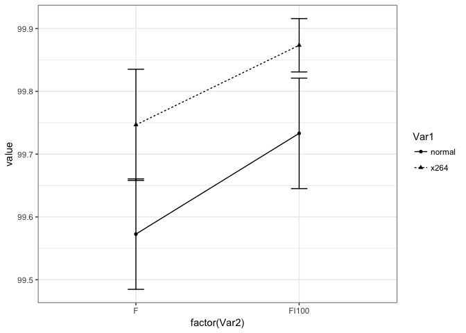

``` {.r}
my.nestedBoxplot(subset(DATA, VARIABLE == "PCORRECT"))
```

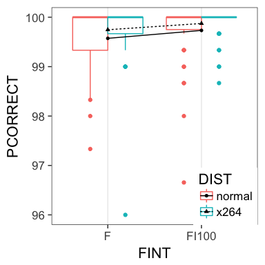

### Significant differences: Tukey HSD

``` {.r}
hsd.hv <- TukeyHSD(aov(value ~ FINT * DIST, data = droplevels(subset(DATA, VARIABLE == "HV"))))
pander(hsd.hv$FINT)
```

<table>
<colgroup>
<col width="19%" />
<col width="11%" />
<col width="9%" />
<col width="11%" />
<col width="12%" />
</colgroup>
<thead>
<tr class="header">
<th align="center"> </th>
<th align="center">diff</th>
<th align="center">lwr</th>
<th align="center">upr</th>
<th align="center">p adj</th>
</tr>
</thead>
<tbody>
<tr class="odd">
<td align="center"><strong>FI100-F</strong></td>
<td align="center">0.06621</td>
<td align="center">0.0654</td>
<td align="center">0.06702</td>
<td align="center">7.572e-14</td>
</tr>
</tbody>
</table>

``` {.r}
pander(hsd.hv$DIST)
```

<table>
<colgroup>
<col width="25%" />
<col width="11%" />
<col width="11%" />
<col width="11%" />
<col width="12%" />
</colgroup>
<thead>
<tr class="header">
<th align="center"> </th>
<th align="center">diff</th>
<th align="center">lwr</th>
<th align="center">upr</th>
<th align="center">p adj</th>
</tr>
</thead>
<tbody>
<tr class="odd">
<td align="center"><strong>x264-normal</strong></td>
<td align="center">0.01242</td>
<td align="center">0.01162</td>
<td align="center">0.01323</td>
<td align="center">7.572e-14</td>
</tr>
</tbody>
</table>

``` {.r}
pander(hsd.hv$`FINT:DIST`)
```

<table>
<colgroup>
<col width="41%" />
<col width="12%" />
<col width="12%" />
<col width="12%" />
<col width="12%" />
</colgroup>
<thead>
<tr class="header">
<th align="center"> </th>
<th align="center">diff</th>
<th align="center">lwr</th>
<th align="center">upr</th>
<th align="center">p adj</th>
</tr>
</thead>
<tbody>
<tr class="odd">
<td align="center"><strong>FI100:normal-F:normal</strong></td>
<td align="center">0.06531</td>
<td align="center">0.06381</td>
<td align="center">0.06681</td>
<td align="center">7.572e-14</td>
</tr>
<tr class="even">
<td align="center"><strong>F:x264-F:normal</strong></td>
<td align="center">0.01153</td>
<td align="center">0.01003</td>
<td align="center">0.01303</td>
<td align="center">7.572e-14</td>
</tr>
<tr class="odd">
<td align="center"><strong>FI100:x264-F:normal</strong></td>
<td align="center">0.07863</td>
<td align="center">0.07713</td>
<td align="center">0.08013</td>
<td align="center">7.572e-14</td>
</tr>
<tr class="even">
<td align="center"><strong>F:x264-FI100:normal</strong></td>
<td align="center">-0.05379</td>
<td align="center">-0.05529</td>
<td align="center">-0.05229</td>
<td align="center">7.572e-14</td>
</tr>
<tr class="odd">
<td align="center"><strong>FI100:x264-FI100:normal</strong></td>
<td align="center">0.01332</td>
<td align="center">0.01182</td>
<td align="center">0.01482</td>
<td align="center">7.572e-14</td>
</tr>
<tr class="even">
<td align="center"><strong>FI100:x264-F:x264</strong></td>
<td align="center">0.06711</td>
<td align="center">0.06561</td>
<td align="center">0.06861</td>
<td align="center">7.572e-14</td>
</tr>
</tbody>
</table>

``` {.r}
hsd.pc <- TukeyHSD(aov(value ~ FINT * DIST, data = droplevels(subset(DATA, VARIABLE == "PCORRECT"))))
pander(hsd.pc$FINT)
```

<table>
<colgroup>
<col width="19%" />
<col width="9%" />
<col width="12%" />
<col width="9%" />
<col width="9%" />
</colgroup>
<thead>
<tr class="header">
<th align="center"> </th>
<th align="center">diff</th>
<th align="center">lwr</th>
<th align="center">upr</th>
<th align="center">p adj</th>
</tr>
</thead>
<tbody>
<tr class="odd">
<td align="center"><strong>FI100-F</strong></td>
<td align="center">0.1436</td>
<td align="center">-0.01271</td>
<td align="center">0.2999</td>
<td align="center">0.07155</td>
</tr>
</tbody>
</table>

``` {.r}
pander(hsd.pc$DIST)
```

<table>
<colgroup>
<col width="25%" />
<col width="9%" />
<col width="13%" />
<col width="9%" />
<col width="9%" />
</colgroup>
<thead>
<tr class="header">
<th align="center"> </th>
<th align="center">diff</th>
<th align="center">lwr</th>
<th align="center">upr</th>
<th align="center">p adj</th>
</tr>
</thead>
<tbody>
<tr class="odd">
<td align="center"><strong>x264-normal</strong></td>
<td align="center">0.1571</td>
<td align="center">0.0008222</td>
<td align="center">0.3134</td>
<td align="center">0.04882</td>
</tr>
</tbody>
</table>

``` {.r}
pander(hsd.pc$`FINT:DIST`)
```

<table>
<colgroup>
<col width="41%" />
<col width="11%" />
<col width="11%" />
<col width="9%" />
<col width="9%" />
</colgroup>
<thead>
<tr class="header">
<th align="center"> </th>
<th align="center">diff</th>
<th align="center">lwr</th>
<th align="center">upr</th>
<th align="center">p adj</th>
</tr>
</thead>
<tbody>
<tr class="odd">
<td align="center"><strong>FI100:normal-F:normal</strong></td>
<td align="center">0.1604</td>
<td align="center">-0.13</td>
<td align="center">0.4509</td>
<td align="center">0.4813</td>
</tr>
<tr class="even">
<td align="center"><strong>F:x264-F:normal</strong></td>
<td align="center">0.174</td>
<td align="center">-0.1165</td>
<td align="center">0.4644</td>
<td align="center">0.4085</td>
</tr>
<tr class="odd">
<td align="center"><strong>FI100:x264-F:normal</strong></td>
<td align="center">0.3007</td>
<td align="center">0.01028</td>
<td align="center">0.5912</td>
<td align="center">0.03928</td>
</tr>
<tr class="even">
<td align="center"><strong>F:x264-FI100:normal</strong></td>
<td align="center">0.01353</td>
<td align="center">-0.2769</td>
<td align="center">0.304</td>
<td align="center">0.9994</td>
</tr>
<tr class="odd">
<td align="center"><strong>FI100:x264-FI100:normal</strong></td>
<td align="center">0.1403</td>
<td align="center">-0.1502</td>
<td align="center">0.4307</td>
<td align="center">0.5949</td>
</tr>
<tr class="even">
<td align="center"><strong>FI100:x264-F:x264</strong></td>
<td align="center">0.1268</td>
<td align="center">-0.1637</td>
<td align="center">0.4172</td>
<td align="center">0.6709</td>
</tr>
</tbody>
</table>

Detach R packages
=================

``` {.r}
try(detach(package:ggplot2))
try(detach(package:reshape2))
try(detach(package:car))
try(detach(package:pander))
```
