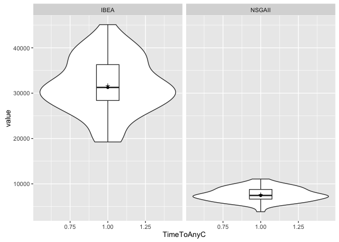

Statistical companion
================
Stefan Sobernig
2016-08-25

-   Prequisites
    -   R packages
-   Data description
    -   ALGO=IBEA
    -   ALGO=NSGAII
-   Analysis of variances (for ALGO = IBEA)
    -   Checks
    -   Anova table: Hypervolume (HV)
    -   Anova table: PCORRECT
-   Exact Replication
    -   Exact vs. adjusted replication
    -   Detach R packages

Prequisites
===========

R packages
----------

``` {.r}
wants <- c("ggplot2", "reshape2", "car", "pander")
has   <- wants %in% rownames(installed.packages())
if(any(!has)) install.packages(wants[!has], repos = "http://cran.us.r-project.org")
```

``` {.r}
library(reshape2)
library(ggplot2)
library(car)
library(pander)

load("toybox.RData")
levels(all$DIST) <- c("normal", "uniform", "x264", "origSayyadASE13")

df.toybox <- subset(all, DIST != "origSayyadASE13")
df.ase13 <- subset(all, DIST == "origSayyadASE13")

my.nestedBoxplot <- function(data, response.var = "value") {
         
    means <- melt(acast(data, DIST ~ OBJ,
                        fun.aggregate = mean, value.var = response.var, na.rm = TRUE))
    
    se <- melt(acast(data, DIST ~ OBJ,
                     function(x) { sd(x, na.rm = TRUE)/sqrt(length(x[!is.na(x)])) }, value.var = response.var))

    
    means$Var1 <- as.character(means$Var1)
    means$se <- se[,3]
    colnames(means) <- c("DIST","OBJ","value","se")

ggplot(data) + 
    geom_boxplot(aes(x = factor(OBJ), y = value, colour = DIST)) + 
    geom_point(data = means, aes(x = factor(OBJ), y = value, shape=DIST)) +
    geom_line(data = means, aes(x = factor(OBJ), y = value, group = DIST, linetype = DIST)) + 
    theme_bw(base_size = 20) + theme(panel.grid.major.y = element_blank(), panel.grid.minor.y = element_blank(), legend.justification=c(1,0), legend.position=c(1,0)) + ylab(unique(data$VARIABLE)[1]) + xlab("COST")

}

my.interactionPlot <- function(data , response.var = "value") {
    means <- melt(acast(data, DIST ~ OBJ,
                        fun.aggregate = mean, value.var = response.var, na.rm = TRUE))
    
    se <- melt(acast(data, DIST ~ OBJ,
                     function(x) { sd(x, na.rm = TRUE)/sqrt(length(x[!is.na(x)])) }, value.var = response.var))

    
    means$Var1 <- as.character(means$Var1)
    means$se <- se[,3]

    ggplot(means, aes(x = factor(Var2), y = value, group = Var1)) + 
        geom_line(aes(linetype = Var1)) + geom_point(aes(shape = Var1)) +
            geom_errorbar(aes(ymax=value+se, ymin=value-se), width=.1) +
                theme_bw()
}
```

Data description
================

### ALGO=IBEA

``` {.r}
DATA <- subset(df.toybox, ALGO == "IBEA" & OBJ %in% c("F","FI20","FI100"))
```

``` {.r}
acast(DATA, DIST ~ OBJ, length)
```

    ##           F FI100 FI20
    ## normal  200   200  200
    ## uniform 200   200  200
    ## x264    200   200  200

``` {.r}
ggplot(na.omit(subset(DATA, VARIABLE=="HV")), aes(y=value, x = 1)) +
    geom_violin() + geom_boxplot(width = 0.2) +
        facet_wrap(DIST ~ OBJ, ncol = 3, drop = TRUE) +
            stat_summary(fun.y="median", geom="point") +
                stat_summary(fun.y="mean", geom="point", shape=3) + xlab("HV")
```


``` {.r}
ggplot(na.omit(subset(DATA, VARIABLE=="PCORRECT")), aes(y=value, x = 1)) +
    geom_violin() + geom_boxplot(width = 0.2) +
        facet_wrap(DIST ~ OBJ, ncol = 3, drop = TRUE) +
            stat_summary(fun.y="median", geom="point") +
                stat_summary(fun.y="mean", geom="point", shape=3) + xlab("PCORRECT")
```


``` {.r}
ggplot(na.omit(subset(DATA, VARIABLE=="TimeToAnyC")), aes(y=value, x = 1)) +
    geom_violin() + geom_boxplot(width = 0.2) +
        facet_wrap(DIST ~ OBJ, ncol = 3, drop = TRUE) +
            stat_summary(fun.y="median", geom="point") +
                stat_summary(fun.y="mean", geom="point", shape=3) + xlab("TimeToAnyC")
```


### ALGO=NSGAII

``` {.r}
DATA <- subset(df.toybox, ALGO == "NSGAII" & OBJ %in% c("F","FI20","FI100"))
```

``` {.r}
acast(DATA, DIST ~ OBJ, length)
```

    ##           F FI100 FI20
    ## normal  200   200  200
    ## uniform 200   200  200
    ## x264    200   200  200

``` {.r}
ggplot(na.omit(subset(DATA, VARIABLE=="HV")), aes(y=value, x = 1)) +
    geom_violin() + geom_boxplot(width = 0.2) +
        facet_wrap(DIST ~ OBJ, ncol = 3, drop = TRUE) +
            stat_summary(fun.y="median", geom="point") +
                stat_summary(fun.y="mean", geom="point", shape=3) + xlab("HV")
```


``` {.r}
ggplot(na.omit(subset(DATA, VARIABLE=="PCORRECT" & value < 1000)), aes(y=value, x = 1)) +
    geom_violin() + geom_boxplot(width = 0.2) +
        facet_wrap(DIST ~ OBJ, ncol = 3, drop = TRUE) +
            stat_summary(fun.y="median", geom="point") +
                stat_summary(fun.y="mean", geom="point", shape=3) + xlab("PCORRECT")
```


``` {.r}
ggplot(na.omit(subset(DATA, VARIABLE=="TimeToAnyC" & value < 50000)), aes(y=value, x = 1)) +
    geom_violin() + geom_boxplot(width = 0.2) +
        facet_wrap(DIST ~ OBJ, ncol = 3, drop = TRUE) +
            stat_summary(fun.y="median", geom="point") +
                stat_summary(fun.y="mean", geom="point", shape=3) + xlab("TimeToAnyC")
```


Analysis of variances (for ALGO = IBEA)
=======================================

``` {.r}
DATA <- subset(df.toybox, ALGO == "IBEA" & OBJ %in% c("F","FI100") & DIST %in% c("normal","x264"))
```

### Checks

### Anova table: Hypervolume (HV)

``` {.r}
d.hv.glm <- glm(value ~ OBJ * DIST, family = gaussian, data = subset(DATA, VARIABLE == "HV"))

ggplot(na.omit(subset(DATA, VARIABLE == "HV")), aes(y=value, x = 1)) +
    geom_violin() + geom_boxplot(width = 0.2) +
        facet_wrap(DIST ~ OBJ, ncol = 2, drop = TRUE) +
            stat_summary(fun.y="median", geom="point") +
                stat_summary(fun.y="mean", geom="point", shape=3) + xlab("HV")
```


``` {.r}
panderOptions('digits', 4)
## panderOptions('round', 4)
panderOptions('keep.trailing.zeros', TRUE)
pander(anova(d.hv.glm, test = "F"))
```

<table>
<caption>Analysis of Deviance Table</caption>
<colgroup>
<col width="20%" />
<col width="6%" />
<col width="15%" />
<col width="16%" />
<col width="18%" />
<col width="8%" />
<col width="13%" />
</colgroup>
<thead>
<tr class="header">
<th align="center"> </th>
<th align="center">Df</th>
<th align="center">Deviance</th>
<th align="center">Resid. Df</th>
<th align="center">Resid. Dev</th>
<th align="center">F</th>
<th align="center">Pr(&gt;F)</th>
</tr>
</thead>
<tbody>
<tr class="odd">
<td align="center"><strong>NULL</strong></td>
<td align="center">NA</td>
<td align="center">NA</td>
<td align="center">199</td>
<td align="center">0.0079</td>
<td align="center">NA</td>
<td align="center">NA</td>
</tr>
<tr class="even">
<td align="center"><strong>OBJ</strong></td>
<td align="center">1</td>
<td align="center">0.00679</td>
<td align="center">198</td>
<td align="center">0.00111</td>
<td align="center">81544</td>
<td align="center">9.51e-259</td>
</tr>
<tr class="odd">
<td align="center"><strong>DIST</strong></td>
<td align="center">1</td>
<td align="center">0.001059</td>
<td align="center">197</td>
<td align="center">5.159e-05</td>
<td align="center">12714</td>
<td align="center">3.371e-180</td>
</tr>
<tr class="even">
<td align="center"><strong>OBJ:DIST</strong></td>
<td align="center">1</td>
<td align="center">3.527e-05</td>
<td align="center">196</td>
<td align="center">1.632e-05</td>
<td align="center">423.5</td>
<td align="center">7.173e-51</td>
</tr>
</tbody>
</table>

``` {.r}
pander(aov(value ~ OBJ * DIST, data = droplevels(subset(DATA, VARIABLE == "HV"))))
```

<table>
<caption>Analysis of Variance Model</caption>
<colgroup>
<col width="22%" />
<col width="6%" />
<col width="13%" />
<col width="13%" />
<col width="13%" />
<col width="13%" />
</colgroup>
<thead>
<tr class="header">
<th align="center"> </th>
<th align="center">Df</th>
<th align="center">Sum Sq</th>
<th align="center">Mean Sq</th>
<th align="center">F value</th>
<th align="center">Pr(&gt;F)</th>
</tr>
</thead>
<tbody>
<tr class="odd">
<td align="center"><strong>OBJ</strong></td>
<td align="center">1</td>
<td align="center">0.00679</td>
<td align="center">0.00679</td>
<td align="center">81544</td>
<td align="center">9.51e-259</td>
</tr>
<tr class="even">
<td align="center"><strong>DIST</strong></td>
<td align="center">1</td>
<td align="center">0.001059</td>
<td align="center">0.001059</td>
<td align="center">12714</td>
<td align="center">3.371e-180</td>
</tr>
<tr class="odd">
<td align="center"><strong>OBJ:DIST</strong></td>
<td align="center">1</td>
<td align="center">3.527e-05</td>
<td align="center">3.527e-05</td>
<td align="center">423.5</td>
<td align="center">7.173e-51</td>
</tr>
<tr class="even">
<td align="center"><strong>Residuals</strong></td>
<td align="center">196</td>
<td align="center">1.632e-05</td>
<td align="center">8.327e-08</td>
<td align="center">NA</td>
<td align="center">NA</td>
</tr>
</tbody>
</table>

``` {.r}
my.interactionPlot(subset(DATA, VARIABLE == "HV"))
```


``` {.r}
my.nestedBoxplot(subset(DATA, VARIABLE == "HV"))
```


### Anova table: PCORRECT

``` {.r}
d.pc.glm <- glm(value ~ OBJ * DIST, family = gaussian, data = subset(DATA, VARIABLE == "PCORRECT"))

ggplot(na.omit(subset(DATA, VARIABLE == "PCORRECT")), aes(y=value, x = 1)) +
    geom_violin() + geom_boxplot(width = 0.2) +
        facet_wrap(DIST ~ OBJ, ncol = 2, drop = TRUE) +
            stat_summary(fun.y="median", geom="point") +
                stat_summary(fun.y="mean", geom="point", shape=3) + xlab("PCORRECT")
```


``` {.r}
pander(anova(d.pc.glm, test = "F"))
```

<table>
<caption>Analysis of Deviance Table</caption>
<colgroup>
<col width="20%" />
<col width="6%" />
<col width="15%" />
<col width="16%" />
<col width="18%" />
<col width="8%" />
<col width="13%" />
</colgroup>
<thead>
<tr class="header">
<th align="center"> </th>
<th align="center">Df</th>
<th align="center">Deviance</th>
<th align="center">Resid. Df</th>
<th align="center">Resid. Dev</th>
<th align="center">F</th>
<th align="center">Pr(&gt;F)</th>
</tr>
</thead>
<tbody>
<tr class="odd">
<td align="center"><strong>NULL</strong></td>
<td align="center">NA</td>
<td align="center">NA</td>
<td align="center">199</td>
<td align="center">2392</td>
<td align="center">NA</td>
<td align="center">NA</td>
</tr>
<tr class="even">
<td align="center"><strong>OBJ</strong></td>
<td align="center">1</td>
<td align="center">1280</td>
<td align="center">198</td>
<td align="center">1112</td>
<td align="center">3098</td>
<td align="center">4.697e-122</td>
</tr>
<tr class="odd">
<td align="center"><strong>DIST</strong></td>
<td align="center">1</td>
<td align="center">6.48</td>
<td align="center">197</td>
<td align="center">1106</td>
<td align="center">15.68</td>
<td align="center">0.0001048</td>
</tr>
<tr class="even">
<td align="center"><strong>OBJ:DIST</strong></td>
<td align="center">1</td>
<td align="center">1025</td>
<td align="center">196</td>
<td align="center">80.99</td>
<td align="center">2479</td>
<td align="center">3.378e-113</td>
</tr>
</tbody>
</table>

``` {.r}
pander(aov(value ~ OBJ * DIST, data = droplevels(subset(DATA, VARIABLE == "PCORRECT"))))
```

<table>
<caption>Analysis of Variance Model</caption>
<colgroup>
<col width="22%" />
<col width="6%" />
<col width="12%" />
<col width="13%" />
<col width="13%" />
<col width="13%" />
</colgroup>
<thead>
<tr class="header">
<th align="center"> </th>
<th align="center">Df</th>
<th align="center">Sum Sq</th>
<th align="center">Mean Sq</th>
<th align="center">F value</th>
<th align="center">Pr(&gt;F)</th>
</tr>
</thead>
<tbody>
<tr class="odd">
<td align="center"><strong>OBJ</strong></td>
<td align="center">1</td>
<td align="center">1280</td>
<td align="center">1280</td>
<td align="center">3098</td>
<td align="center">4.697e-122</td>
</tr>
<tr class="even">
<td align="center"><strong>DIST</strong></td>
<td align="center">1</td>
<td align="center">6.48</td>
<td align="center">6.48</td>
<td align="center">15.68</td>
<td align="center">0.0001048</td>
</tr>
<tr class="odd">
<td align="center"><strong>OBJ:DIST</strong></td>
<td align="center">1</td>
<td align="center">1025</td>
<td align="center">1025</td>
<td align="center">2479</td>
<td align="center">3.378e-113</td>
</tr>
<tr class="even">
<td align="center"><strong>Residuals</strong></td>
<td align="center">196</td>
<td align="center">80.99</td>
<td align="center">0.4132</td>
<td align="center">NA</td>
<td align="center">NA</td>
</tr>
</tbody>
</table>

``` {.r}
my.interactionPlot(subset(DATA, VARIABLE == "PCORRECT"))
```


``` {.r}
my.nestedBoxplot(subset(DATA, VARIABLE == "PCORRECT"))
```


Exact Replication
=================

``` {.r}
acast(df.ase13, VARIABLE ~ ALGO, length)
```

    ##            IBEA NSGAII
    ## HV           50     50
    ## PCORRECT     50     50
    ## TimeTo50C    50     50
    ## TimeToAnyC   50     50

``` {.r}
ggplot(na.omit(subset(df.ase13, VARIABLE=="HV")), aes(y=value, x = 1)) +
    geom_violin() + geom_boxplot(width = 0.2) +
        facet_wrap( ~ ALGO, ncol = 2, drop = FALSE) +
            stat_summary(fun.y="median", geom="point") +
                stat_summary(fun.y="mean", geom="point", shape=3) + xlab("HV")
```


``` {.r}
ggplot(na.omit(subset(df.ase13, VARIABLE=="PCORRECT")), aes(y=value, x = 1)) +
    geom_violin() + geom_boxplot(width = 0.2) +
        facet_wrap( ~ ALGO, ncol = 2, drop = FALSE) +
            stat_summary(fun.y="median", geom="point") +
                stat_summary(fun.y="mean", geom="point", shape=3) + xlab("PCORRECT")
```


``` {.r}
ggplot(na.omit(subset(df.ase13, VARIABLE=="TimeTo50C")), aes(y=value, x = 1)) +
    geom_violin() + geom_boxplot(width = 0.2) +
        facet_wrap( ~ ALGO, ncol = 2, drop = FALSE) +
            stat_summary(fun.y="median", geom="point") +
                stat_summary(fun.y="mean", geom="point", shape=3) + xlab("TimeTo50C")
```


``` {.r}
ggplot(na.omit(subset(df.ase13, VARIABLE=="TimeToAnyC")), aes(y=value, x = 1)) +
    geom_violin() + geom_boxplot(width = 0.2) +
        facet_wrap( ~ ALGO, ncol = 2, drop = FALSE) +
            stat_summary(fun.y="median", geom="point") +
                stat_summary(fun.y="mean", geom="point", shape=3) + xlab("TimeToAnyC")
```



``` {.r}
mean <- dcast(na.omit(subset(df.ase13, VARIABLE != "TimeTo50C")), VARIABLE ~ ALGO, mean)
sd <- dcast(na.omit(subset(df.ase13, VARIABLE != "TimeTo50C")), VARIABLE ~ ALGO, sd)
median <- dcast(na.omit(subset(df.ase13, VARIABLE != "TimeTo50C")), VARIABLE ~ ALGO, median)
mad <- dcast(na.omit(subset(df.ase13, VARIABLE != "TimeTo50C")), VARIABLE ~ ALGO, mad)
min <- dcast(na.omit(subset(df.ase13, VARIABLE != "TimeTo50C")), VARIABLE ~ ALGO, min)
```

    ## Warning in .fun(.value[0], ...): kein nicht-fehlendes Argument für min;
    ## gebe Inf zurück

``` {.r}
max <- dcast(na.omit(subset(df.ase13, VARIABLE != "TimeTo50C")), VARIABLE ~ ALGO, max)
```

    ## Warning in .fun(.value[0], ...): kein nicht-fehlendes Argument für max;
    ## gebe -Inf zurück

``` {.r}
knitr::kable(cbind(mean, sd[,2:3], median[,2:3], mad[,2:3], min[,2:3], max[,2:3]), format = "markdown", digits=4)
```

|VARIABLE|IBEA|NSGAII|IBEA|NSGAII|IBEA|NSGAII|IBEA|NSGAII|IBEA|NSGAII|IBEA|NSGAII|
|:-------|---:|-----:|---:|-----:|---:|-----:|---:|-----:|---:|-----:|---:|-----:|
|HV|0.2200|0.2119|0.0087|0.0013|0.2227|0.2121|0.0004|0.0011|0.1903|0.2081|0.2232|0.2144|
|PCORRECT|31.2533|10.9800|20.4951|2.0989|25.1667|10.8333|0.7413|2.2239|24.0000|6.6667|100.0000|16.0000|
|TimeToAnyC|31687.1200|7642.1200|6073.7676|1510.4444|31263.5000|7436.5000|6621.2916|1729.4529|19241.0000|3855.0000|45109.0000|11058.0000|

### Exact vs. adjusted replication

``` {.r}
df.contr <- rbind(cbind(df.ase13, EXP="exact"),
     cbind(subset(df.toybox, OBJ == "F" & DIST == "normal"), EXP="adjusted"))
acast(df.contr, EXP ~ ALGO, length)
```

    ##          IBEA NSGAII
    ## exact     200    200
    ## adjusted  200    200

``` {.r}
ggplot(na.omit(subset(df.contr, VARIABLE=="HV")), aes(y=value, x = 1)) +
    geom_violin() + geom_boxplot(width = 0.2) +
        facet_wrap(EXP ~ ALGO, ncol = 2, drop = FALSE) +
            stat_summary(fun.y="median", geom="point") +
                stat_summary(fun.y="mean", geom="point", shape=3) + xlab("HV")
```


``` {.r}
ggplot(na.omit(subset(df.contr, VARIABLE=="PCORRECT")), aes(y=value, x = 1)) +
    geom_violin() + geom_boxplot(width = 0.2) +
        facet_wrap(EXP ~ ALGO, ncol = 2, drop = FALSE) +
            stat_summary(fun.y="median", geom="point") +
                stat_summary(fun.y="mean", geom="point", shape=3) + xlab("PCORRECT")
```


Detach R packages
-----------------

``` {.r}
try(detach(package:ggplot2))
try(detach(package:reshape2))
try(detach(package:car))
```
